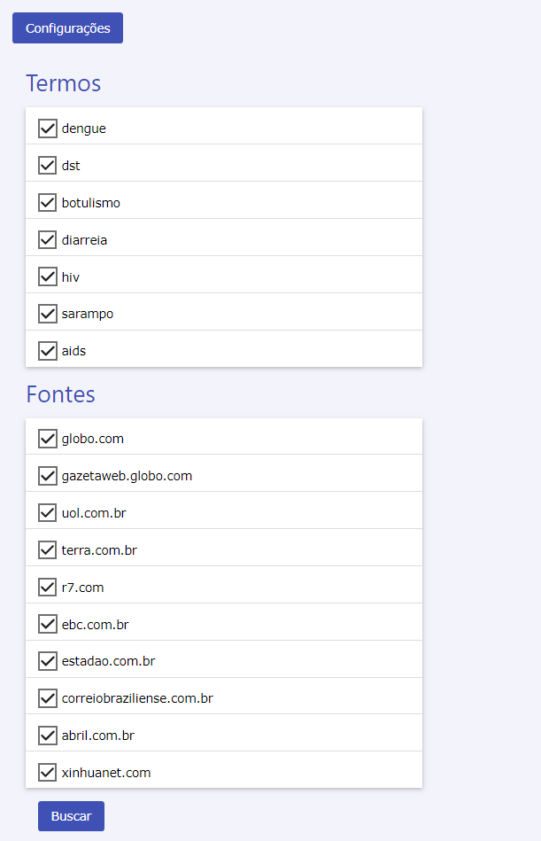
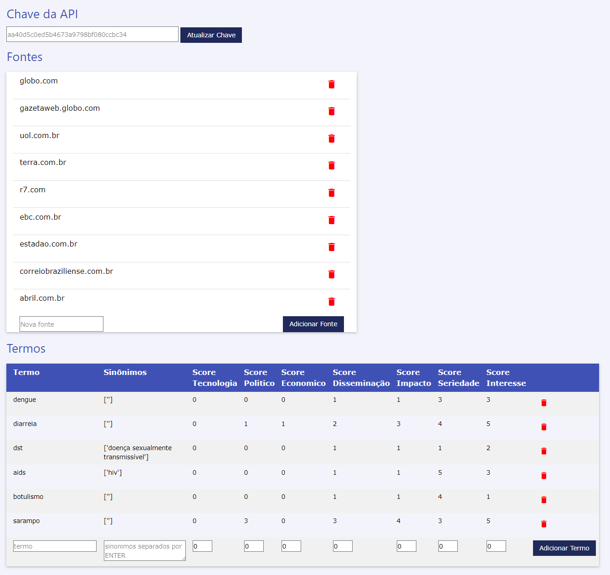
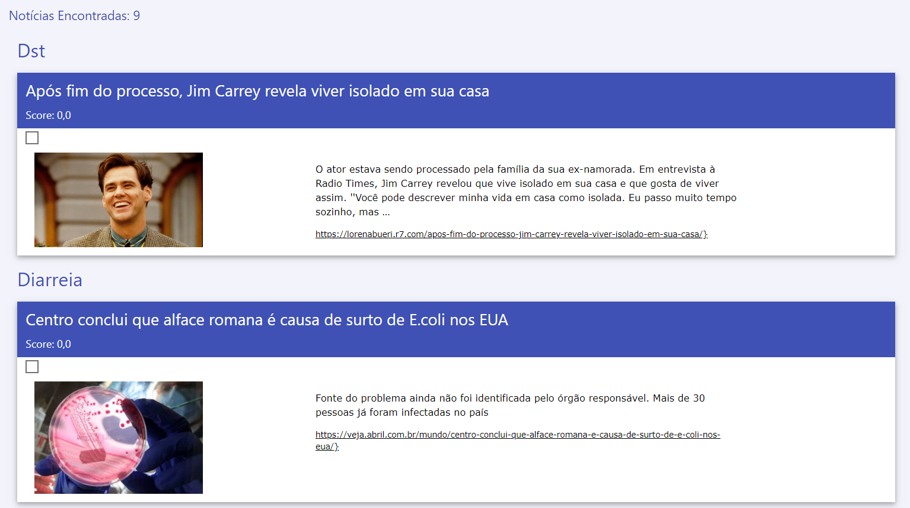
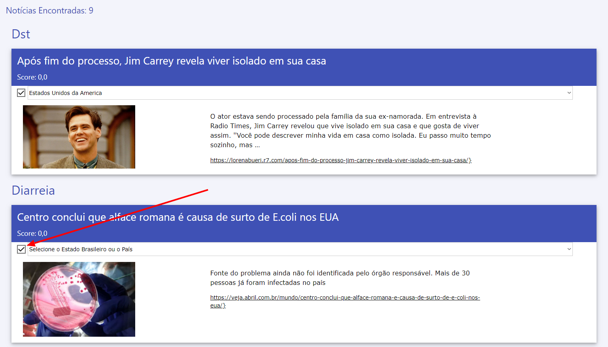
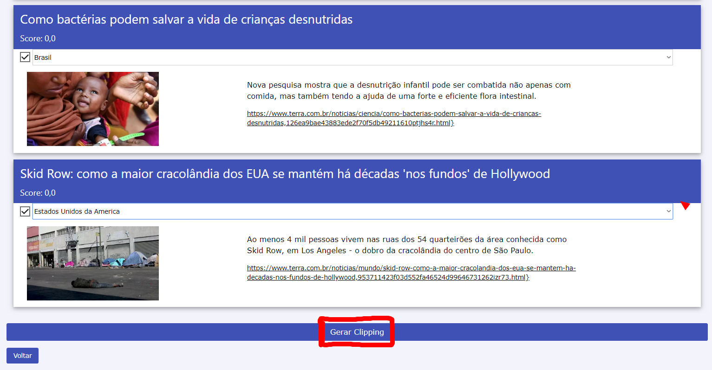
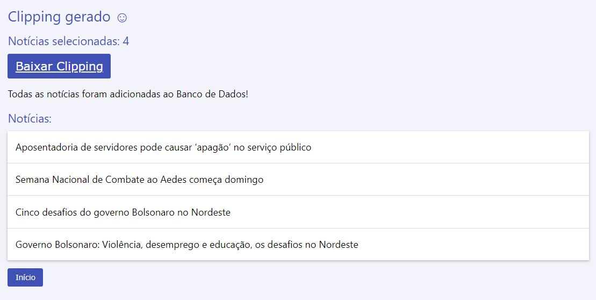

# News-Searcher

O News Searcher é um sistema simples que coleta notícias da internet, classifica-as e gera parte do clipping de notícias produzido pela equipe na Sala de Situação.

Este projeto foi criado para eles ([Sala de Situação](https://fs.unb.br/saladesituacao/)), adaptado às suas necessidades.
Se você for trabalhar nele, como usuário, **este manual irá guiá-lo na utilização do sistema**.

## Busca de Notícias

Neste sistema é possível buscar termos de interesse em diferentes fontes desejadas.

Segue a foto da página inicial do sistema.

Na imagem acima pode-se visualizar que existe a possibilidade de escolher quais termos vão ser buscados, basta seleciona-los. Além disso, também é possível escolher a fonte (o site) em a busca será feita, seguindo a mesma ideia dos termos, selecionando-as.

Botões:
- **Configurações**: Vai para a aba de configurações do sistema;
- **Busca**: Realiza a busca a partir dos termos e fontes selecionados.

## Configurações

Nesta página encontra-se todas as configurações do sistema.

### Chave da API

Como é utilizada a [NewsAPI](https://newsapi.org) como API de busca e ela possui uma chave de acesso, dentro da aba de configurações é possível atualiza-la se ela expirar com o tempo. 

Se eventualmente a chave parar de funciona, o sistema notificará tal fato e mostrará como resolve-lo.

### Fontes

É possível adicionar e remover fontes de busca. Para adicionar, basta copiar o link da fonte e clicar em 'Adicionar Fonte', já para remover, basta clicar no ícone de lixeira ao lado da fonte que deseja remover.

### Termos

Também é possível adicionar e remover termos de busca. A remoção é feita de maneira idêntica a das fontes. Já a adição de um termo possui um maior numero de campos:
- Termo: Palavra ou Termo principal a ser buscado;
- Sinônimos: Um ou mais sinônimos do termo principal, separados por ENTER;
- Scores: valores de 0 a 5, sendo eles o peso para cada tipo de busca.

## Busca

### Resultados da Busca

Após clicar em BUSCAR a busca é realizada e é feito um ranqueamento da notícia de acordo com os scores apresentados para cada termo. Essa etapa pode demorar alguns segundos, pois o sitema irá varrer por todas as fontes e todos os termos de busca para encontra-los, além de rankea-los também.

Na imagem é possível visualizar os resultados da busca, rankeados a partir do maior score e separados por cada termo.

Os resultados são acompanhados do título da Noticia, um resumo do conteúdo da mesma e de qual fonte ela foi tirada.

### Selecionar Resultados

Existe uma caixa clicavél para cada notícia, ao clicada esta notícia está selecionada como uma das notícias desejadas e além disso é solicitado que se insira a região da qual a notícia se refere, podendo ser no Brasil(todos os estados) ou no Mundo(todos os países).

### Gerar Clipping

Ao final da página de resultados, existe um botão chamado 'Gerar Clipping', como visto na imagem:

Ao ser clicada deverá aguardar um tempo, pois as noticias selecionadas serão enviadas ao banco de dados e será preparada uma prévia do clipping de notícias.

### Clipping Gerado e Banco Atualizado

Agora o clipping foi gerado e pode ser baixado clicando em 'Baixar Clipping'. Além disso, as notícias selecionadas foram adicionadas ao banco de dados de notícias.